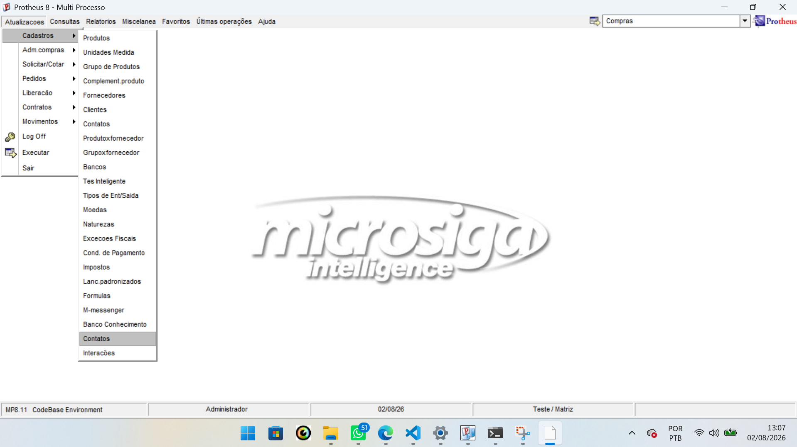
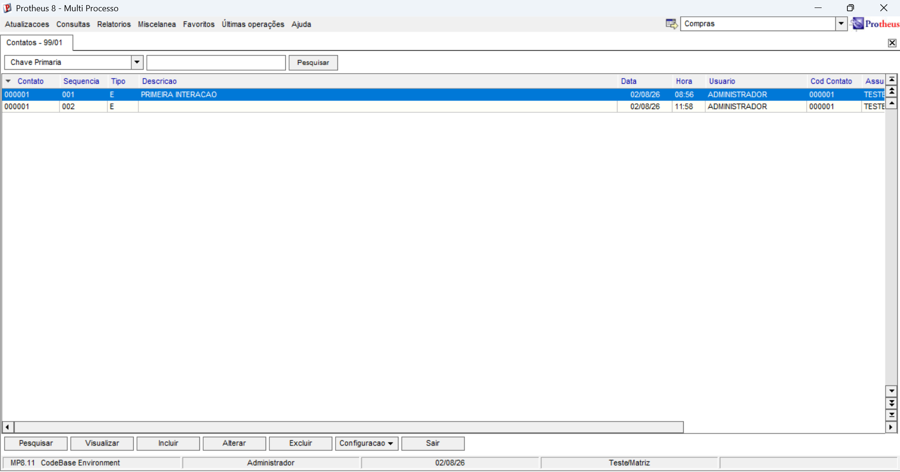

# Exercício 04 — Menu no SIGACOM

## Objetivo

Configurar o menu do módulo de Compras para disponibilizar as rotinas de:

- Contatos;
- Interações.

A configuração foi realizada no `SIGACFG`, utilizando o recurso de Menu do Sistema.

## Estrutura criada

```text
Compras
└── Atualizações
    └── Cadastros
        ├── Contatos
        └── Interações
```

## Configuração do item Contatos

O item `Contatos` foi configurado com os seguintes dados:

- Português: `Contatos`
- Espanhol: `Contatos`
- Inglês: `Contacts`
- Módulo: `Compras`
- Tipo: `Função de Usuário`
- Programa: `STTIP003`
- Tabela: `SZ1`
- Status: `Habilitado`

A rotina `STTIP003` corresponde ao cadastro de Contatos.

## Configuração do item Interações

O item `Interações` foi configurado com os seguintes dados:

- Português: `Interações`
- Espanhol: `Interacciones`
- Inglês: `Interactions`
- Módulo: `Compras`
- Tipo: `Função de Usuário`
- Programa: `STTIP004B`
- Tabela: `SZ2`
- Status: `Habilitado`

A rotina `STTIP004B` corresponde à listagem geral de Interações, sem filtro por contato.

## Geração do menu

Após a criação dos dois itens, o menu foi gerado com os seguintes dados:

```text
Arquivo: SIGACOM
Diretório: \system\
```

O arquivo de menu existente foi substituído no ambiente de estudos.

## Testes realizados

Após gerar o menu e abrir novamente o Protheus no módulo de Compras, foram realizados os seguintes testes:

- o item `Contatos` apareceu no menu;
- o item `Interações` apareceu no menu;
- a rotina de Interações abriu sem erro;
- os registros cadastrados foram exibidos corretamente;
- os campos virtuais Código do Contato e Assunto foram apresentados no browse.

## Evidências

### Evidência 01 — Menu configurado

A imagem abaixo comprova que os itens `Contatos` e `Interações` foram adicionados ao menu do módulo de Compras.



### Evidência 02 — Rotina de Interações aberta pelo menu

A imagem abaixo comprova que a rotina `STTIP004B` foi executada corretamente pelo menu.



## Resultado obtido

As duas rotinas foram adicionadas ao menu do módulo de Compras e executadas corretamente.

## Status

✅ Exercício concluído com sucesso.